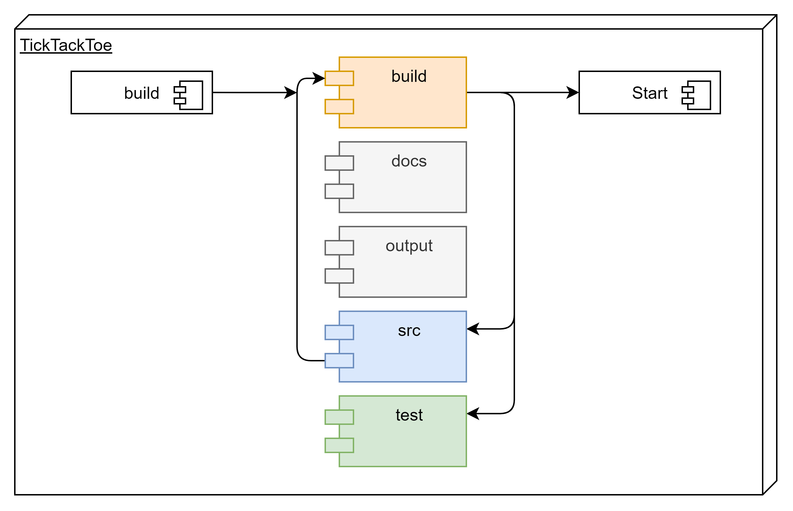

# infm2100_2021

Coderepository for Module INFM2100 for Autumnsemester 2021/2

In diesem Projekt werden zwei Ansätze einer Wertebasierten KI für ein TicTacToe Spiel dargestellt.

Projekt ist in der folgenden Modulstruktur aufgebaut:

## Infos zum Starten

Folgende Libs **müssen** zuvor installiert werden, damit alles funktioniert:

File-Handling
* dill
* pickle
* os
* path
* nbconvert

KI
* random
* keras

Coding
* numpy
* abc
* enum
* collections
* time
* waiting

Visual
* plantuml
* IPython.core.display
* plotly
* matplotlib
* ipywidgets
* tqdm.notebook

## Buildreihenfolge

1. build.ipynb Notebook öffnen und alle Zellen starten
2. Start.ipynb Notebook öffnen und gwünschte Zellen starten
3. Tests aus dem Notebook unter test/ starten 
